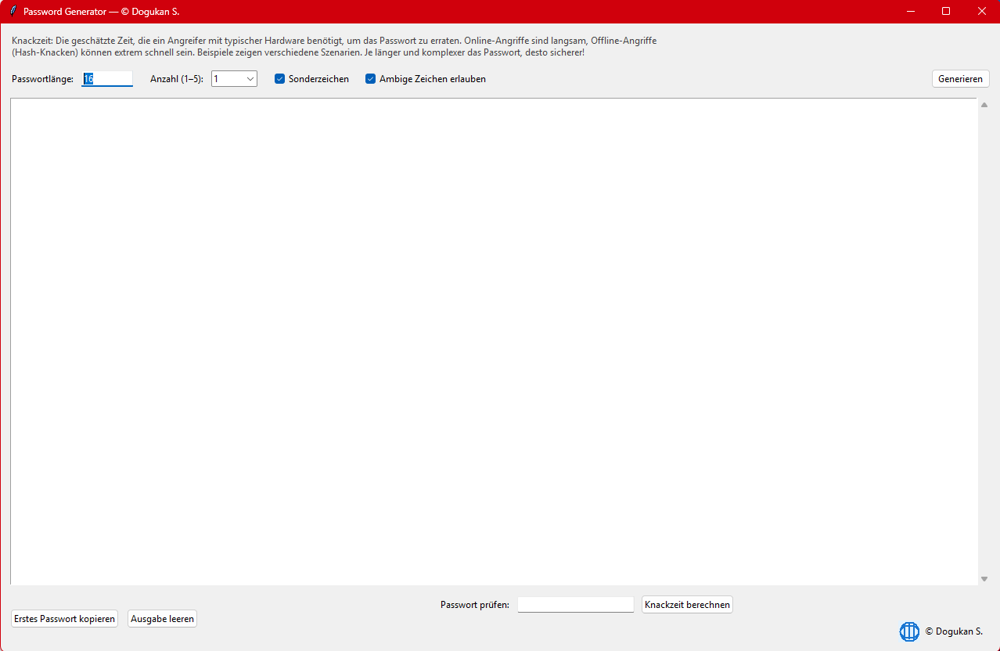

# PWGen GUI — Secure Password Generator


A local, GUI-based password generator providing cryptographically secure randomness,
entropy analysis, and realistic online/offline cracking time estimates.



## Features
- Cryptographically secure password generation (`secrets`)
- Configurable length (8–256 characters)
- Optional symbols and ambiguous characters
- Entropy calculation and strength rating
- SHA-256 hash display (informational)
- Estimated cracking times for multiple attacker models
- Password strength checker for existing passwords
- Fully offline, no network access

## Requirements
- Python 3.10+
- No external dependencies

## Platform Support

- **Source (`.py`)**: Windows, Linux, macOS (Python 3.10+)
- **Prebuilt binaries (`.exe`)**: Windows only


## Run
```bash
python pwgen_gui.py
or use the exe.-file

 ## License
MIT License © Dogukan S.
